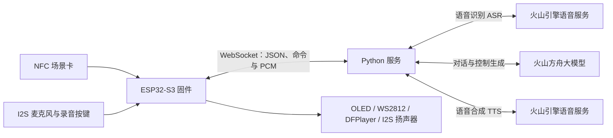

# ESP32-S3 智能陪伴八音盒

一个结合 NFC 场景卡、语音对话、灯光和本地音乐的毕业设计项目。ESP32-S3 负责硬件交互，Python 服务负责接入语音识别、大模型和语音合成，双方通过 WebSocket 通信。

本仓库同时包含设备固件和 Python 服务，便于了解端云协同的实现方式。它是毕业设计原型，尚未完成本次整理后的实机与真实云服务全链路验证。

## 功能

| 功能 | 当前代码实现 |
| --- | --- |
| NFC 场景切换 | 专注、助眠、治愈三类场景；在线发送场景事件，离线使用本地音乐和灯光 |
| 语音交互 | 按键或串口命令触发约 3 秒录音，上传 PCM，接收识别、模型回复及合成语音 |
| 文本交互 | 通过串口输入文本，发送到 Python 服务处理 |
| 灯光与屏幕 | WS2812 显示状态和氛围灯光，OLED 显示交互状态、回复和情绪图标 |
| 本地音乐 | DFPlayer Mini 播放 microSD 上的音乐，支持播放控制及情绪曲目选择 |
| 网络与回退 | Wi-Fi / WebSocket 重连、心跳，以及断网或云端错误时的本地回退 |

## 系统架构



设备上行包括 `scene_event`、`heartbeat`、文本提问，以及 `CMD:START_RECORD` / `CMD:STOP_RECORD` 之间的二进制音频。服务下行包括控制 JSON，以及 `CMD:TTS_BEGIN` / `CMD:TTS_END` 之间的音频分片。语音链路使用 16 kHz、16 bit、单声道 PCM；I2S 麦克风的原始采样在固件中转换后上传。

## 硬件与技术栈

固件使用 PlatformIO、Arduino 框架和 FreeRTOS，目标配置为 ESP32-S3、16 MB Flash、OPI PSRAM（N16R8 配置）。软件依赖由 `platformio.ini` 管理：ArduinoJson、ArduinoWebsockets、FastLED、MFRC522、DFRobotDFPlayerMini 和 U8g2。

| 硬件 / 信号 | ESP32-S3 GPIO / 配置 |
| --- | --- |
| I2S 麦克风 WS / SD / SCK | 4 / 5 / 6 |
| 录音按键 | 47，内部上拉，按下接地 |
| MAX98357A BCLK / LRC / DIN | 15 / 16 / 9 |
| SSD1306 OLED SDA / SCL | 41 / 42，128×64，地址 `0x3C` |
| RC522 CS / MOSI / SCK / MISO / RST | 10 / 11 / 12 / 13 / 14 |
| DFPlayer UART RX / TX（ESP32 侧） | 17 / 18，与模块 TX / RX 交叉连接 |
| WS2812 数据线 / 灯珠数 | 38 / 8 |

引脚及公共参数见 [`include/config.h`](include/config.h)，私人网络配置使用 `include/config.local.h`。接线时按各模块规格确认供电、电平和共地；这里的表格仅描述固件信号映射。

## 目录结构

```text
.
├── platformio.ini                 # 开发板、构建设置及固件依赖
├── include/                       # 模块头文件、引脚及配置示例
├── src/                           # 控制器、网络、音频、灯光等固件实现
├── server/
│   ├── server.py                  # Python WebSocket 服务
│   ├── requirements.txt           # Python 直接依赖版本
│   └── README.md                  # 服务环境变量及启动说明
├── lib/                           # PlatformIO 本地库目录
└── test/                          # PlatformIO 测试目录，目前无自动化测试用例
```

## 快速开始

### 1. 获取代码并配置设备

```powershell
git clone https://github.com/Yinuo31/Graduation-Project.git
cd Graduation-Project
Copy-Item include/config.local.example.h include/config.local.h
```

编辑 `include/config.local.h`，填写自己的 Wi-Fi 和服务器地址。`WEBSOCKET_SERVER` 只填写 IP 或域名，不加协议、端口或路径。设备连接 `ws://服务器地址:8765/`，服务器必须能从设备所在网络访问；不能填写设备自身的 `localhost`。

### 2. 启动 Python 服务

安装 Python 3.12，按 [服务端说明](server/README.md) 创建虚拟环境、安装依赖并设置云服务环境变量，然后执行：

```powershell
.\.venv\Scripts\python.exe server/server.py
```

服务默认监听 `0.0.0.0:8765`。在电脑或服务器上允许设备访问 TCP 8765，并保持进程运行。克隆或上传 GitHub 代码不会自动部署这个服务。

### 3. 构建与烧录固件

安装 VS Code 的 PlatformIO IDE 扩展，打开本目录，可使用扩展的 Build、Upload 和 Serial Monitor。若 PlatformIO CLI 已加入 PATH，也可执行：

```powershell
pio run
pio run --target upload
pio device monitor --baud 115200
```

### 4. 准备场景卡与音乐

`src/app_controller.cpp` 的 `kScenes` 表保存三类 NFC 卡 UID。请用自己的卡 UID 替换示例值，否则刷卡不能匹配预置场景。UID 可从刷卡串口日志读取。

DFPlayer 使用 microSD 的 `/MP3/0001.mp3` 等四位编号文件。场景回退曲目为 1、2、3；情绪曲目区间为 happy：1–5、calm：6–10、focus：11–15、tired：16–20、sad：21–25。准备相应文件，或修改 `kScenes` / `kMoodProfiles` 映射。本仓库不包含音乐素材。

## 使用方式

- 刷场景卡切换专注、助眠或治愈氛围。
- 按录音键触发约 3 秒录音；串口输入 `r` 也可触发录音。
- 串口输入 `m1`、`m2`、`m3`，测试前三首本地音乐。
- 串口输入普通文本并发送换行，可进行文本交互；本地识别到的音乐命令会优先在设备侧处理。

## 当前限制

- 云端语音与对话需要自行开通相应服务、配置凭据，并承担服务调用费用。
- 服务端部分标题及错误文本目前仍含 `????` 占位。本次整合保留原业务代码，未修复这些文字。
- 当前设备连接使用明文 WebSocket，服务未实现设备鉴权。远程部署需要自行配置访问控制，不建议直接暴露到任意公网访问。
- 本次软件检查不等于实物验证：麦克风、扬声器、刷卡、音乐播放以及真实 ASR / LLM / TTS 调用仍需实机联调。
- 未添加开源许可证；公开展示代码不等于已授予通用开源使用许可。

请勿提交 Wi-Fi 密码、云服务 API Key 或访问令牌。私人配置、虚拟环境和临时文件已列入 `.gitignore`。
