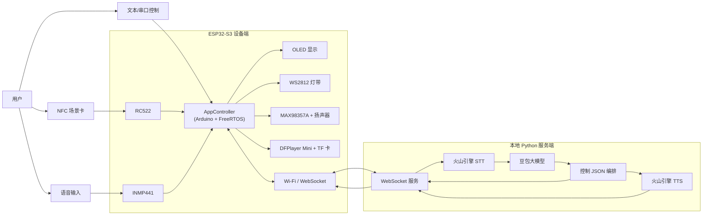
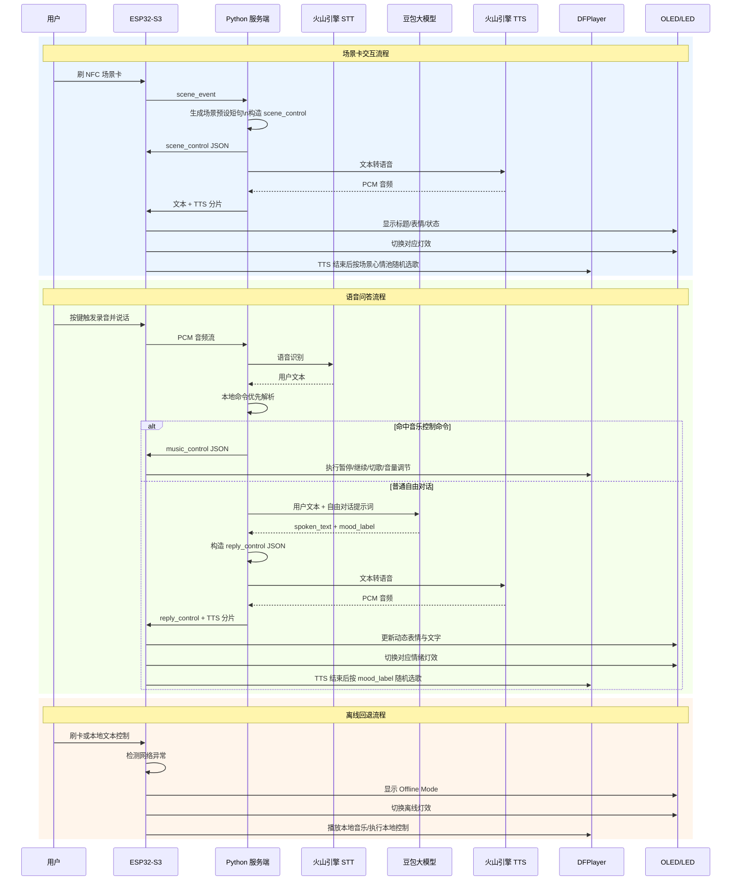

# 论文图示草稿

以下图示为毕业论文可直接参考的草稿版本，后续可在 Visio、ProcessOn 或 draw.io 中重绘为正式论文插图。

## 1. 系统总体框图

### 图示说明

- 用户可通过 NFC 卡、语音或文本三种方式与系统交互。
- ESP32-S3 作为设备端主控，负责外设驱动、任务调度和本地执行。
- Python 服务端负责语音识别、大模型回复、语音合成及控制指令编排。
- OLED、灯带、TTS 扬声器和 DFPlayer 本地音乐共同构成交互输出层。

## 2. 端云交互流程图

### 图示说明

- 场景卡路径采用快速响应方案，不再经过大模型推理，以降低等待时间。
- 语音问答路径中，简单音乐控制命令优先按规则解析，普通对话再进入大模型。
- 大模型返回的核心结果为短回复文本和心情标签，设备端依据心情标签随机播放本地曲库。
- 离线模式下系统仍可执行刷卡播放和部分本地控制功能。

## 3. 可继续补画的论文图

后续建议再补以下三张图：

1. FreeRTOS 多任务划分图
2. 控制 JSON 协议字段关系图
3. 情绪标签与本地曲库映射图

